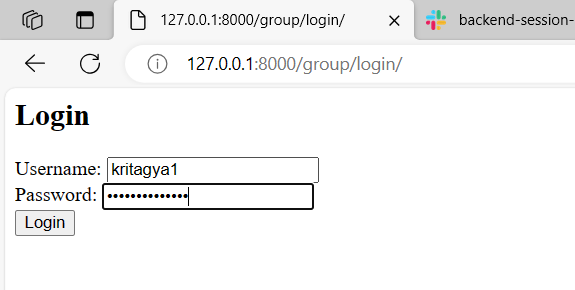
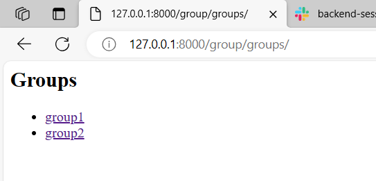
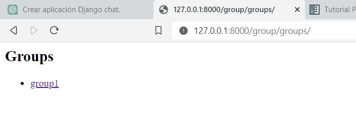
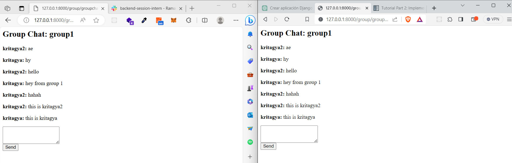
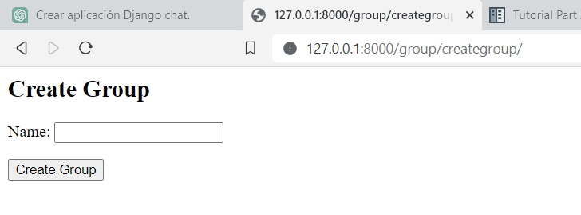
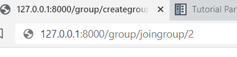
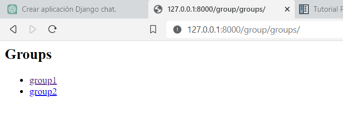
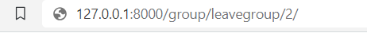
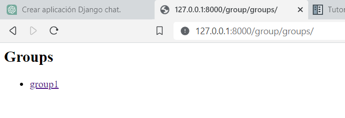
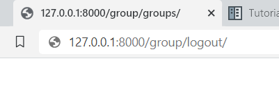

<h1>Python Django Group chat using web socket</h1>

<h2>Sign Up page</h2>

<h2>Login Page</h2>

<h2>Group the user(kritagya2) has joined</h2>

<h2>Group the user(kritagya) has joined</h2>

<h2>Chat room : group1</h2>

<h2>Creating group</h2>

<h2>Joining group</h2>

Here '2' represent the group id. So user will be joining group with id 2

after joining, the group will be displayed in the groups list.

<h2>Leaving the group</h2>

Here '2' is the group id.

After leaving the group2

<h2>Logging user out</h2>
